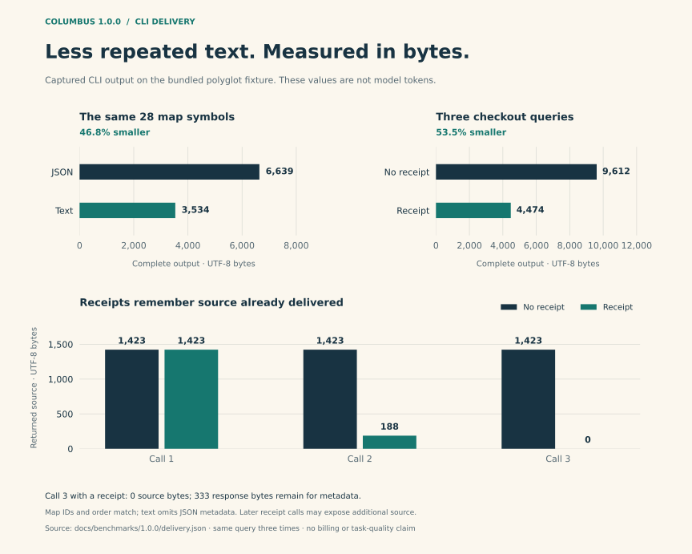
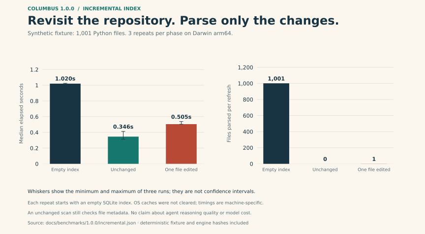
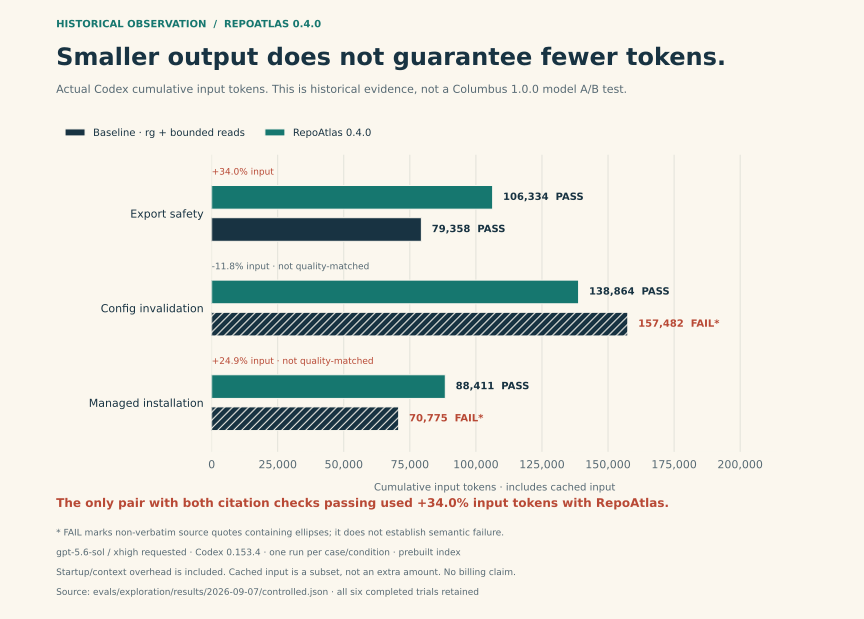

# Columbus

**Navigate your codebase. Bring back the context you need.**

[한국어](README.ko.md) · [Published releases](https://github.com/ch4570/columbus/releases) · [Benchmarks](docs/benchmarks/README.md) · [Installation](INSTALL.md) · [Validation](VALIDATION.md)

**1.1.0 is an unreleased candidate.** The mandatory [actual-token gate failed](evals/multilang-token-batch/ANALYSIS.md), so its release assets are unavailable. To try this checkout, use the local installation below; release-download examples apply after publication.

[Real spring-core evaluation: three navigation fixes, measured indexing costs, and unresolved graph limits.](evals/spring-core/README.md)

Columbus gives coding agents a local map of a repository. Find an entry point, follow its relationships, and read verified source in a bounded response. A compass, a map, and an explorer are the project's visual identity; the evidence still comes from your code.

**66 language detection profiles · Incremental SQLite index · 4 graph formats · CLI, skill & optional MCP · MIT**

No LLM or API key is needed to index a repository. Columbus does not build or execute the project. Python, Java, and Kotlin use ASTs; 43 profiles use declaration heuristics; other UTF-8 text stays searchable as files. [Language coverage](docs/languages.md).

The Columbus 1.1 candidate includes parent-first AST JSONL trees (`columbus tree --label NAME`), portable agent-skill installation, and explicit pre-commit refresh integration. [AST processing and repository workflow](docs/portable-ast-workflow.md).

Keep a complete gzip/XZ graph in Git and query stored relationships without SQLite or project source. With a matching checkout, read bounded declaration source verified against the archive's hashes. [Versioned graph workflow](docs/portable-graph-workflow.md).

The ordinary distribution uses upstream Java grammar `0.23.5`; the experimental annotation-parser candidate `0.23.5+columbus.1` remains separate. [Release scope and compatibility](docs/releases/1.1.0.md).

## Set sail in three commands

Requires **Python 3.11+** and [uv](https://docs.astral.sh/uv/getting-started/installation/). Run the install command from this Columbus checkout, then run the last two commands inside the project you want to explore.

```sh
uv tool install .
columbus explore
columbus explore checkout
```

`explore` shows a small repository map. Add a symbol or keyword to retrieve relevant source, with a default limit of 2,000 estimated tokens. Both commands synchronize the local index automatically. Use `--repo /path/to/project` from another directory. Running `columbus` alone shows a short guide.

**Already use pipx?** Replace `uv tool install` with `pipx install`. If the executable is not on PATH, follow the tool's hint (`uv tool update-shell` or `pipx ensurepath`). The pinned GitHub wheel is the distribution; these instructions do not assume a PyPI package named Columbus.

<details>
<summary>Only have Python?</summary>

After 1.1.0 is published, download the standalone installer and run it:

```sh
curl -fL https://github.com/ch4570/columbus/releases/download/v1.1.0/get-columbus.py -o get-columbus.py
python3 get-columbus.py
```

On Windows, download [get-columbus.py](https://github.com/ch4570/columbus/releases/download/v1.1.0/get-columbus.py) and run `py -3 get-columbus.py`. The installer verifies the wheel's SHA-256, creates a dedicated user environment, checks its health, and prints the command location. It preserves unrelated installations and shell configuration. [Offline installation and troubleshooting](INSTALL.md).

</details>

Used the RepoAtlas preview? Columbus has a new command, skill, configuration name, and cache. [Migration instructions](INSTALL.md#moving-from-the-repoatlas-preview).

## Choose your route

| Your task | Command |
| --- | --- |
| Understand an unfamiliar repository | `columbus explore` |
| Locate a feature or exact symbol ID | `columbus search checkout --format text --limit 5` |
| Inspect declarations before source | `columbus context checkout --mode signatures --format text` |
| Read the relevant source | `columbus explore checkout` |
| Follow calls, imports, or inheritance | `columbus neighbors EXACT_SYMBOL_ID --kinds calls imports inherits --format text` |
| Inspect incoming relationships | `columbus impact EXACT_SYMBOL_ID --format text` |
| Share an interactive graph | `columbus graph --level file --format html --output graph.html` |

For a missing Python instance-receiver hop, `neighbors` and `impact` accept `--include-candidates`. This opt-in follows lexical member hints labelled `candidate_calls[retrieval_only]`; they remain unresolved references and never become stored call edges. Runtime dispatch and external mutation still require source review. Candidate lookup reads cached parse facts across the repository, so it costs more than the default edge lookup.

Use IDs returned by `search`. `impact` is a bounded graph traversal, not proof of every runtime effect. Existing automation commands retain their JSON default; `explore` defaults to readable text.

## Let an agent travel light

For a known name or file, start with a short search or a direct source read. Use a map when the structure is unclear, then inspect relationships only when they help answer the question. Stop when the evidence is sufficient.

```sh
columbus init
columbus explore checkout --session checkout
columbus explore calculateTotal --session checkout
columbus stats checkout
```

`init` installs `.agents/skills/columbus/SKILL.md` in the current project. A named session keeps a source receipt and local query measurements under `.columbus/sessions/checkout/`. Later snippet queries omit source ranges already delivered and continue unread portions. `stats` reports query count, response bytes, and source bytes.

A receipt records delivered source; it does not restore a model's lost context. Use a new session for a new task, another agent, or after context loss. Telemetry is opt-in and records metadata without queries or source bodies. Add `.columbus/` to your project's ignore rules.

```text
Read .agents/skills/columbus/SKILL.md. Start with the smallest useful
search or source range. Use a bounded map only when the structure is
unclear. Reuse one session for this task's source queries and stop
when the evidence answers the question. Verify source before editing,
then run the relevant tests and synchronize the index.
```

[Agent workflow, receipt limits, and MCP setup](docs/agents.md).

## Benchmarks, with the rough seas included

**Smaller tool responses are measurable. Lower model-token usage is a separate question.** The graphs are generated from recorded JSON; their data and plotting script ship with the source release.

The [eleven earlier model comparisons](evals/model-usage-overview/REPORT.md) contain no pair meeting the unchanged quality-preserving total-input/output reduction gate. The separately frozen [Java, Kotlin/Java and JavaScript cohort](evals/multilang-token-batch/ANALYSIS.md) also fails all six pairs: actual input and output both increase in every comparison, and no pair satisfies the full citation/semantic gate. Columbus 1.1 does not establish actual model-token savings. The charts below retain their historical engine versions and measurements.

### Columbus 1.0: response delivery



This model-free benchmark measures actual UTF-8 CLI output on the included polyglot fixture. The map comparison verifies the same ordered symbol IDs. The repeated-context comparison uses the same query three times; receipts can deliver previously unread ranges before returning only status metadata. Bytes and the CLI's byte-based token estimate are not model usage or billed cost.

| Comparison | Before | After | Change |
| --- | ---: | ---: | ---: |
| Same 28 map items: JSON → text | 6,639 bytes | 3,534 bytes | **46.8% smaller** |
| Three context calls: no receipt → receipt | 9,612 bytes | 4,474 bytes | **53.5% smaller** |
| Source across receipt calls 1 → 2 → 3 | 1,423 bytes | 188 → 0 bytes | No repeated source after exhaustion |

[Current measurements, fixture hashes, methodology, and reproduction commands](docs/benchmarks/README.md).

### Revisit a repository without reparsing it all



On a deterministic 1,001-file Python fixture, initial indexing parsed 1,001 files, an unchanged refresh parsed and hashed 0, and editing one file reparsed 1. The chart shows the median and min–max range of three runs on macOS arm64. An unchanged scan still checks file metadata; timing is machine-specific and OS caches were not cleared. [Fixture, raw runs, and reproduction](docs/benchmarks/README.md).

### Real agent exploration: the earlier pilot



These runs used the **RepoAtlas 0.4.0** engine, before the Columbus rename. Three fixed questions on the same real source snapshot; ordinary `rg` and bounded reads versus those tools plus the graph. Each condition ran once with Codex CLI 0.153.4, requested model `gpt-5.6-sol`, and effort `xhigh`. A prebuilt graph was supplied; its 1.105-second construction was measured separately.

| Question | Citation check, ordinary → graph | Actual cumulative input, ordinary → graph | Change |
| --- | --- | ---: | ---: |
| Graph export protection | Pass → Pass | 79,358 → 106,334 | **+34.0%** |
| Configuration invalidation | Fail → Pass | 157,482 → 138,864 | −11.8% |
| Managed installation conflicts | Fail → Pass | 70,775 → 88,411 | **+24.9%** |

The two baseline citation failures used ellipses instead of contiguous source quotations; they do not prove semantic misunderstanding and are excluded from equal-quality savings claims. **The only pair passing both citation checks used 34.0% more input. General model-token savings were not established.** In the installation case, command output fell by 49.0% while input increased.

Runtime usage includes startup instructions, repeated context, tool exchanges, and cache behavior. Cached input is already part of input. All six trials and the entire excluded initial empty-index cohort are preserved. This is a small read-only pilot, not a Columbus 1.0 model A/B result. [Prompts, answers, usage, and grading](evals/exploration/results/2026-09-07/controlled.json) · [Full historical report](docs/token-efficiency.md).

## Bring back a graph

```sh
columbus graph --format html --level file --output graph.html
columbus graph --format mermaid --level file --kinds imports calls --output dependencies.mmd
columbus graph --format graphml --language typescript --path 'src/*' --output frontend.graphml
```

| Format | Best for |
| --- | --- |
| HTML | Exploring a self-contained graph offline |
| Mermaid | Editable diagrams in documentation |
| GraphML | Importing into external graph tools |
| JSON | Scripts and structured analysis |

Filter by language, path, relationship, direction, and focus symbol. Graphs expose confidence and truncation; unknown languages still produce file nodes. Existing output files are preserved. [Graph options](docs/usage.md#export-a-graph).

## Under the compass

Discovery finds eligible files. AST and heuristic analyzers add source-backed facts to a local SQLite graph. Retrieval selects declarations or verified source spans within a response budget. CLI, exporters, skill, and MCP share this engine.

The index lives at `.columbus/index-v1.sqlite`. Source shown to an agent remains untrusted repository content. [Architecture and data boundaries](docs/architecture.md).

| Guide | Contents |
| --- | --- |
| [Install](INSTALL.md) | Wheel, Python-only installer, offline use, updates, preview migration |
| [CLI usage](docs/usage.md) · [한국어 사용법](docs/usage.ko.md) | Queries, formats, budgets, freshness |
| [Agent integration](docs/agents.md) | Skill, sessions, receipts, telemetry, MCP |
| [Benchmarks](docs/benchmarks/README.md) | Graphs, data, methodology, reproduction |
| [Validation](VALIDATION.md) | Executed checks and platform limits |
| [Contributing](CONTRIBUTING.md) · [Changelog](CHANGELOG.md) | Development and release history |

[Support](SUPPORT.md) · [Security](SECURITY.md) · [MIT license](LICENSE) · [Character artwork and provenance](docs/assets/columbus-art.md)
