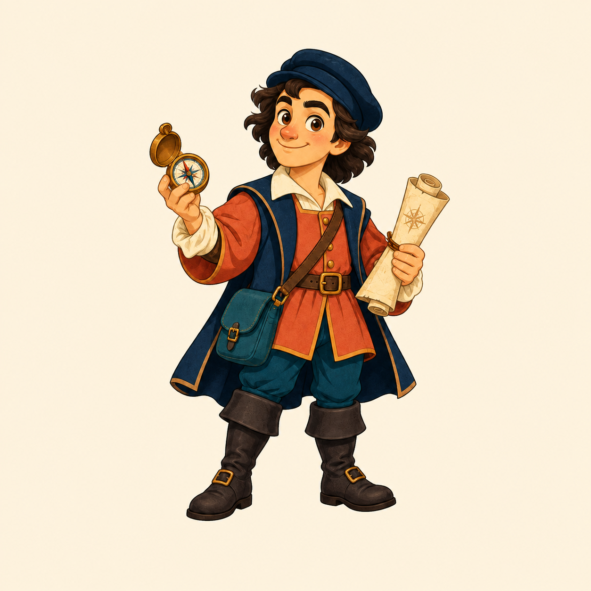

# Columbus visual assets

- [README hero](columbus-hero.png) and [character](columbus-character.png): original generated Columbus illustrations. [Prompts, selected outputs, and provenance](columbus-art.md).
- [Response delivery](benchmark-delivery.svg): actual Columbus CLI output bytes.
- [Actual agent input](benchmark-agent-tokens.svg): historical RepoAtlas 0.4.0 Codex observations, including regressions.
- Benchmark figures are rendered from recorded data with `scripts/plot_benchmarks.py`; they are not generated artwork. [Data, methodology, and reproduction](../benchmarks/README.md).

The previous RepoAtlas artwork is retained in the v0.5.0 Git history. Historical benchmark files keep their original engine names and values.
