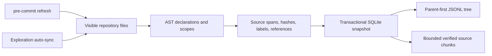

# AST processing, repository installation, and pre-commit

Columbus reads code into AST declarations, scopes and source references; resolves supported relationships; commits one SQLite snapshot; and exposes a labelled declaration tree and bounded, hash-verified source chunks. Python, Java and Kotlin currently use ASTs. Other supported profiles remain heuristics/text and are explicitly excluded from the default AST tree.



## Install into another repository

Use Python 3.11+ and a Columbus revision containing these commands (this source change is newer than the v1.0.0 release assets). Install the wheel built from that revision into an isolated environment, or use the portable ZIP's `install.py --repo PROJECT`. Run `columbus init --repo PROJECT` to install the managed agent skill. Ignore `.columbus/` in the target repository. The source installation and wheel both include the same engine; the target does not need to become a Python project.

```sh
columbus init --repo /path/to/project
columbus tree --repo /path/to/project --label DefaultResourceLoader --limit 50
columbus context EXACT_ID --repo /path/to/project --budget-tokens 2000
```

Tree output is JSONL: metadata followed by nodes with `id`, `parent_id`, `label`, `path`, `start_line`, `end_line`, `source_hash`, `fidelity`, and `partial`. Exact labels select a subtree and its ancestors. Limits retain parents before children. Add `--include-fallback` only when heuristic/text declarations are also useful. JSONL can be saved under `.columbus/`; SQLite remains the authoritative cache, so saved exports must be regenerated after changes.

The tree organizes declarations, not arbitrary token windows. `context ID` reads the relevant source span and fits it into its full response budget. Receipts track partial delivery so an agent can continue a long declaration without repeatedly reading its prefix. Source hashes protect reads from stale cached spans. Call edges remain static candidates and do not prove runtime dispatch.

## pre-commit framework

Run pre-commit itself under Python 3.11+. Add this entry to the target's existing `.pre-commit-config.yaml`, replacing `PINNED_COMMIT_WITH_HOOK` with the reviewed commit containing `.pre-commit-hooks.yaml` (v1.0.0 does not contain it):

```yaml
repos:
  - repo: https://github.com/ch4570/columbus
    rev: PINNED_COMMIT_WITH_HOOK
    hooks:
      - id: columbus-sync
        # Optional: reject parse diagnostics and keep the prior snapshot.
        # args: [--strict]
```

Then run `pre-commit install` and `pre-commit run columbus-sync --all-files`. pre-commit installs Columbus in its isolated environment. `pass_filenames: false` and `always_run: true` let synchronization detect deletions, renames, and configuration changes even when no eligible changed filename remains. `require_serial: true` avoids parallel invocations by the framework. This hook updates the cache and prints a compact summary; it never stages files.

## Native Git hook

For users without a hook manager:

```sh
columbus hook-install --repo /path/to/project --plan
columbus hook-install --repo /path/to/project
```

Installation is explicit and preserves existing hooks, symlink hook paths, and `core.hooksPath`. If a hook manager is already configured, add `columbus hook-update` through it. Native hooks reference the installed interpreter/entrypoint; reinstall them after relocating that environment. A common Git hooks directory can serve linked worktrees because the hook uses the committing worktree's directory.

## Snapshot and failure contract

- `hook-update` indexes the files visible at invocation time, not the Git staging index. Native Git hooks see unstaged edits. pre-commit temporarily hides unstaged tracked edits; untracked files can still be visible. After restoration, normal exploration synchronizes again. Neither mode changes staged source.
- Output includes `scope=visible_worktree`, parsed/removed counts, diagnostics, `parse_complete`, and `semantic_complete=false`. Traversal truncation, parse completeness, and runtime completeness are separate properties.
- Ordinary parsing recovery remains visible and does not itself block commits. I/O, missing dependencies, synchronization conflicts, or other engine errors return nonzero. `--strict` rejects diagnostic-bearing snapshots before replacing the prior graph. It is a parse gate, not a semantic correctness proof.
- Git hooks may be skipped. Query-time synchronization is still needed after edits, checkout, hook skips, and framework restoration.
- `.columbus/` is a local cache. Never add it to commits merely to publish the graph. Export reviewed JSONL or graph artifacts separately when needed.

The current call resolver still has known type-parameter and inherited-overload false-target cases in [issue #8](https://github.com/ch4570/columbus/issues/8). AST declaration trees and exact verified source are usable independently of those inferred call edges. Wider call resolution needs those negative cases gated first.
